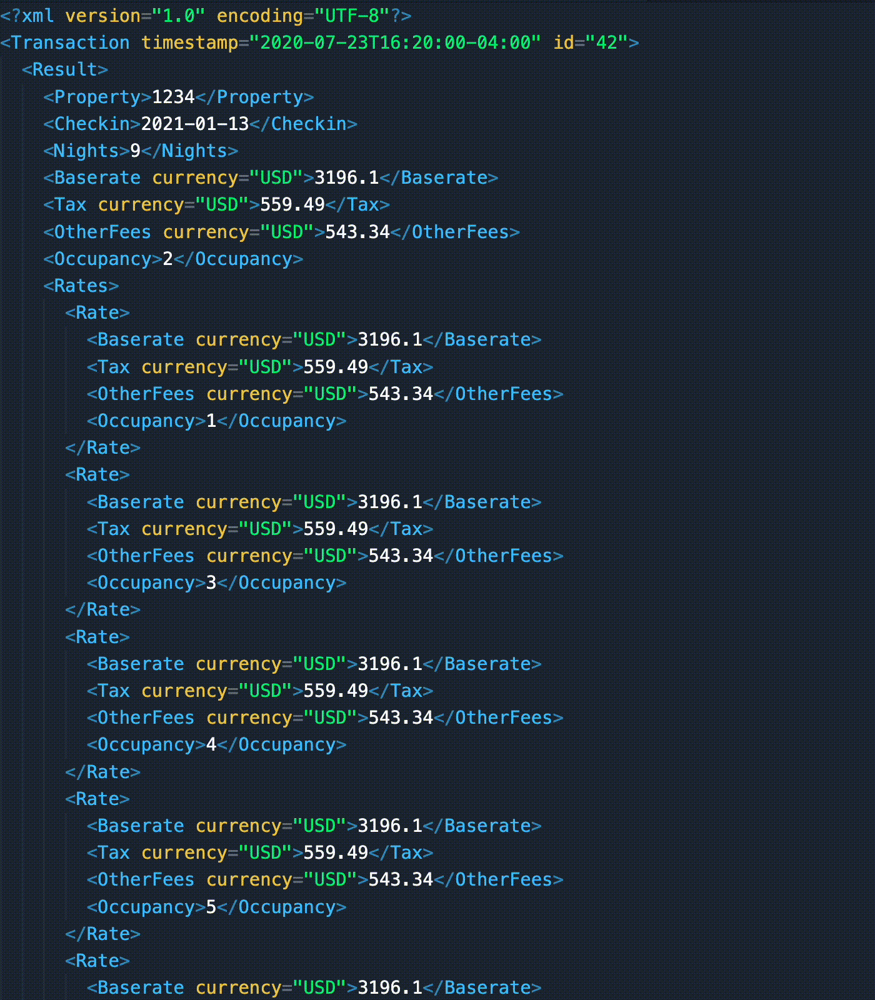

# unfuxml 🛠✨

[](https://github.com/justsml/unfuxml/actions/workflows/test.yml)
[](https://www.npmjs.com/package/unfuxml)
[](https://github.com/justsml/unfuxml)
<!-- [](https://david-dm.org/justsml/unfuxml) -->
<!-- [](https://codeclimate.com/github/justsml/unfuxml) -->
<!-- [](https://codecov.io/gh/justsml/unfuxml) -->

## Why?

> **Unfuxml is the best way to get familiar JSON from XML.**

### The Problem

Most XML to JSON conversion libraries produce JSON which is less-than-clean, difficult-to-traverse, and verbose.

> _Note:_ If 'perfect' bi-directional conversion is required - **this is not the library for you.**.

<!-- [See XML's countless edge cases.](#faq-xml-hell) -->



### Solution

An XML to JSON converter with practical assumptions, and configurable "escape hatches" where appropriate.

Unfuxml features:

- [ ] Key/Node name Transformation
  - [x] Camel-cases by default.
  - [x] Key rewriting function.
  - [ ] Removes namespace prefixes, customize the `keyNameFunction` option to override.
  - [ ] Configurable.
  - [ ] Supports dictionary for simple remapping of poorly named source data.
- [ ] Included stats helper functions. (Test out your XML using [`repl.it`](https://repl.it/) or [`runkit.com/new`](https://runkit.com/new))


## Usage


## Examples


### Example #1

```xml
<?xml version="1.0" encoding="UTF-8"?>
<Transaction timestamp="2020-07-23T16:20:00-04:00" id="42">
  <Result>
    <Property>1234</Property>
    <Checkin>2021-01-13</Checkin>
    <Nights>9</Nights>
    <Baserate currency="USD">3196.1</Baserate>
    <Tax currency="USD">559.49</Tax>
    <OtherFees currency="USD">543.34</OtherFees>
    <Occupancy>2</Occupancy>
    <Rates>
      <Rate>
        <Baserate currency="USD">3196.1</Baserate>
        <Tax currency="USD">559.49</Tax>
        <OtherFees currency="USD">543.34</OtherFees>
        <Occupancy>1</Occupancy>
      </Rate>
      <Rate>
        <Baserate currency="USD">3196.1</Baserate>
        <Tax currency="USD">559.49</Tax>
        <OtherFees currency="USD">543.34</OtherFees>
        <Occupancy>3</Occupancy>
      </Rate>
      <Rate>
        <Baserate currency="USD">3196.1</Baserate>
        <Tax currency="USD">559.49</Tax>
        <OtherFees currency="USD">543.34</OtherFees>
        <Occupancy>4</Occupancy>
      </Rate>
      <Rate>
        <Baserate currency="USD">3196.1</Baserate>
        <Tax currency="USD">559.49</Tax>
        <OtherFees currency="USD">543.34</OtherFees>
        <Occupancy>5</Occupancy>
      </Rate>
      <Rate>
        <Baserate currency="USD">3196.1</Baserate>
        <Tax currency="USD">559.49</Tax>
        <OtherFees currency="USD">543.34</OtherFees>
        <Occupancy>6</Occupancy>
      </Rate>
    </Rates>
  </Result>
</Transaction>
```

```json
{
  "transaction": {
    "id": "42",
    "timestamp": "2020-07-23T16:20:00-04:00",
    "result": {
      "property": 1234,
      "checkin": "2021-01-13",
      "nights": 9,
      "baserate": { "currency": "USD", "value": 3196.1 },
      "tax": { "currency": "USD", "value": 559.49 },
      "otherFees": { "currency": "USD", "value": 543.34 },
      "occupancy": 2,
      "rates": {
        "rate": [
          {
            "baserate": { "currency": "USD", "value": 3196.1 },
            "otherFees": { "currency": "USD", "value": 543.34 },
            "tax": { "currency": "USD", "value": 559.49 },
            "occupancy": 1
          },
          {
            "baserate": { "currency": "USD", "value": 3196.1 },
            "otherFees": { "currency": "USD", "value": 543.34 },
            "tax": { "currency": "USD", "value": 559.49 },
            "occupancy": 3
          },
          {
            "baserate": { "currency": "USD", "value": 3196.1 },
            "otherFees": { "currency": "USD", "value": 543.34 },
            "tax": { "currency": "USD", "value": 559.49 },
            "occupancy": 4
          },
          {
            "baserate": { "currency": "USD", "value": 3196.1 },
            "otherFees": { "currency": "USD", "value": 543.34 },
            "tax": { "currency": "USD", "value": 559.49 },
            "occupancy": 5
          },
          {
            "baserate": { "currency": "USD", "value": 3196.1 },
            "otherFees": { "currency": "USD", "value": 543.34 },
            "tax": { "currency": "USD", "value": 559.49 },
            "occupancy": 6
          }
        ]
      }
    }
  }
}
```

### Example #2

```xml
<?xml version="1.0" encoding="UTF-8"?>
<Transaction timestamp="2017-07-18T16:20:00-04:00" id="42">
  <!-- A transaction message with room types result. -->
  <PropertyDataSet>
    <Property>12345</Property>
    <RoomData>
      <RoomID>single</RoomID>
      <Name>
        <Text text="Single room" language="en"/>
        <Text text="Chambre simple" language="fr"/>
      </Name>
      <Description>
        <Text text="A single room" language="en"/>
        <Text text="Le chambre simple" language="fr"/>
      </Description>
      <PhotoURL>
        <Caption>
          <Text text="Living area" language="en"/>
          <Text text="Le chambre" language="fr"/>
        </Caption>
        <URL>http://www.foo.com/static/bar/image1234.jpg</URL>
      </PhotoURL>
      <PhotoURL>
        <URL>http://www.foo.com/static/bar/image1235.jpg</URL>
      </PhotoURL>
      <Capacity>2</Capacity>
    </RoomData>
    <RoomData>
      <RoomID>double</RoomID>
      <Name>
        <Text text="Double room" language="en"/>
        <Text text="Chambre double" language="fr"/>
      </Name>
      <Occupancy>1</Occupancy>
    </RoomData>
    <PackageData>
      <PackageID>refundbreakfast</PackageID>
      <Name>
        <Text
          text="Refundable Room with Breakfast"
          language="en"
        />
        <Text
          text="Chambre remboursable avec le petit déjeuner"
          language="fr"
        />
      </Name>
      <Description>
        <Text text="Continental Breakfast" language="en"/>
        <Text text="Petit déjeuner continental" language="fr"/>
      </Description>
      <ChargeCurrency>hotel</ChargeCurrency>
      <Refundable available="1" refundable_until_days="3"/>
      <BreakfastIncluded>1</BreakfastIncluded>
    </PackageData>
    <PackageData>
      <PackageID>prepaid</PackageID>
      <Name>
        <Text text="Nonrefundable" language="en"/>
        <Text text="Non remboursable" language="fr"/>
      </Name>
      <Description>
        <Text text="Blah blah blad" language="en"/>
        <Text text="Le blah blah blad" language="fr"/>
      </Description>
      <Occupancy>2</Occupancy>
      <ChargeCurrency>web</ChargeCurrency>
      <Refundable available="0"/>
    </PackageData>
  </PropertyDataSet>
</Transaction>
```

```json
{
  "transaction": {
    "id": "42",
    "timestamp": "2017-07-18T16:20:00-04:00",
    "propertyDataSet": {
      "property": 12345,
      "roomData": [
        {
          "roomId": "single",
          "name": {
            "text": [
              { "text": "Single room", "language": "en" },
              { "text": "Chambre simple", "language": "fr" }
            ]
          },
          "description": {
            "text": [
              { "text": "A single room", "language": "en" },
              { "text": "Le chambre simple", "language": "fr" }
            ]
          },
          "photoUrl": [
            {
              "url": "http://www.foo.com/static/bar/image1234.jpg",
              "caption": {
                "text": [
                  { "text": "Living area", "language": "en" },
                  { "text": "Le chambre", "language": "fr" }
                ]
              }
            },
            {
              "url": "http://www.foo.com/static/bar/image1235.jpg"
            }
          ],
          "capacity": 2
        },
        {
          "roomId": "double",
          "name": {
            "text": [
              { "text": "Double room", "language": "en" },
              { "text": "Chambre double", "language": "fr" }
            ]
          },
          "occupancy": 1
        }
      ],
      "packageData": [
        {
          "packageId": "refundbreakfast",
          "name": {
            "text": [
              { "text": "Refundable Room with Breakfast", "language": "en" },
              { "text": "Chambre remboursable avec le petit déjeuner", "language": "fr" }
            ]
          },
          "description": {
            "text": [
              { "text": "Continental Breakfast", "language": "en" },
              { "text": "Petit déjeuner continental", "language": "fr" }
            ]
          },
          "chargeCurrency": "hotel",
          "refundable": { "available": "1", "refundableUntilDays": "3" },
          "breakfastIncluded": 1
        },
        {
          "packageId": "prepaid",
          "name": {
            "text": [
              { "text": "Nonrefundable", "language": "en" },
              { "text": "Non remboursable", "language": "fr" }
            ]
          },
          "description": {
            "text": [
              { "text": "Blah blah blad", "language": "en" },
              { "text": "Le blah blah blad", "language": "fr" }
            ]
          },
          "occupancy": 2,
          "chargeCurrency": "web",
          "refundable": { "available": "0" } }
      ]
    }
  }
}
```

### Example #3

```xml
<?xml version="1.0" encoding="UTF-8"?>
<RateModifications 
  id="B78BA3ED-31C5-44D7-80F7-69E12AEAA1BD"
  partner="partner_key"
  timestamp="timestamp">
  <HotelRateModifications hotel_id="123" action="overlay">
    <ItineraryRateModification id="35725" action="delete">
      <BookingDates>
        <DateRange
          start="2030-04-15"
          end="2030-04-15"
          days_of_week="M" />
        <DateRange
          start="2030-04-15"
          end="2030-04-15"
          days_of_week="M" />
      </BookingDates>
      <BookingWindow min="integer" max="integer" />
      <CheckinDates>
        <DateRange
          start="2030-04-15"
          end="2030-04-15"
          days_of_week="M" />
      </CheckinDates>
      <CheckoutDates>
        <DateRange
          start="2030-04-15"
          end="2030-04-15"
          days_of_week="M" />
      </CheckoutDates>
      <Devices>
        <Device type="desktop" />
      </Devices>
      <LengthOfStay min="integer" max="integer" />
      <MinimumAmount before_discount="integer" />
      <RatePlans>
        <RatePlan id="PackageID_1" />
        <RatePlan id="PackageID_2" />
      </RatePlans>
      <RoomTypes>
        <RoomType id="RoomID_1" />
        <RoomType id="RoomID_2" />
      </RoomTypes>
      <StayDates application="all">
        <DateRange
          start="2030-04-15"
          end="2030-04-15"
          days_of_week="M" />
      </StayDates>
      <UserCountries type="include">
        <Country code="USA" />
      </UserCountries>
      <ModificationActions>
        <PriceAdjustment multiplier="float" />
        <RateRule id="9876" />
        <Refundable
          available="false"
          refundable_until_days="1"
          refundable_until_time="time" />
        <Availability status="unavailable" />
      </ModificationActions>
    </ItineraryRateModification>
  </HotelRateModifications>
</RateModifications>
```

```json
{
  "rateModifications": {
    "id": "B78BA3ED-31C5-44D7-80F7-69E12AEAA1BD",
    "partner": "partner_key",
    "timestamp": "timestamp",
    "hotelRateModifications": {
      "hotelId": "hotel-id-123-abc",
      "action": "overlay",
      "itineraryRateModification": {
        "id": "357238795",
        "action": "delete",
        "bookingDates": {
          "dateRange": [
            { "start": "2030-04-15", "end": "2030-04-15", "daysOfWeek": "M" },
            { "start": "2030-04-15", "end": "2030-04-15", "daysOfWeek": "M" }
          ]
        },
        "bookingWindow": { "min": "integer", "max": "integer" },
        "checkinDates": {
          "dateRange": { "start": "2030-04-15", "end": "2030-04-15", "daysOfWeek": "M" }
        },
        "checkoutDates": {
          "dateRange": { "start": "2030-04-15", "end": "2030-04-15", "daysOfWeek": "M" }
        },
        "devices": { "device": { "type": "desktop" } },
        "lengthOfStay": { "min": "integer", "max": "integer" },
        "minimumAmount": { "beforeDiscount": "integer" },
        "ratePlans": { "ratePlan": [ { "id": "PackageID_1" }, { "id": "PackageID_2" }] },
        "roomTypes": { "roomType": [ { "id": "RoomID_1" }, { "id": "RoomID_2" }] },
        "stayDates": {
          "dateRange": { "start": "2030-04-15", "end": "2030-04-15", "daysOfWeek": "M" },
          "application": "all"
        },
        "userCountries": { "country": { "code": "USA" }, "type": "include" },
        "modificationActions": {
          "priceAdjustment": { "multiplier": "float" },
          "rateRule": { "id": "9876" },
          "refundable": {
            "available": "false",
            "refundableUntilDays": "1",
            "refundableUntilTime": "time"
          },
          "availability": { "status": "unavailable" }
        }
      }
    }
  }
}
```

## TODO

### Support De-nesting Common Object-Array Patterns

```js
{
  "propertyDataSet": Object {
    "packageData": Array [
      Object {}
  }
}

// Should become single set/array
{
  "propertyDataSet": Array [
    Object {}
  ]
}

```


### FAQ: Xml Hell

#### Potentially Lossy XML Features/Structure

- Representing: Multiple CDATA siblings comingled with Nodes in a Node List.
- Heavy reliance on namespacing. AKA Tag Name prefixes, before the `:`.
